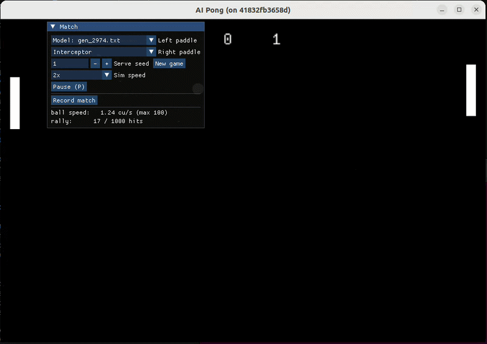
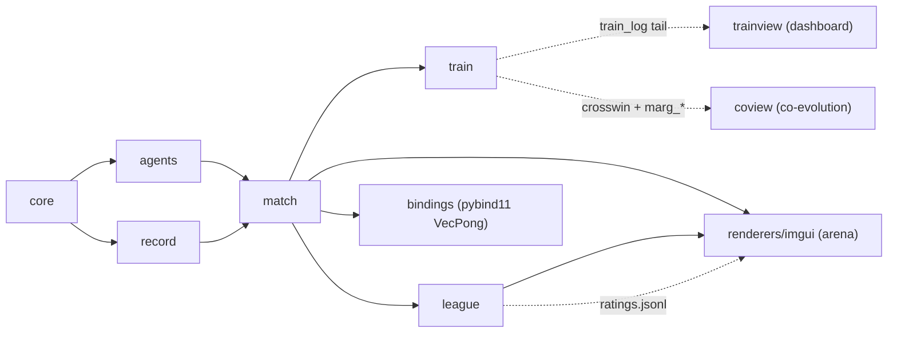
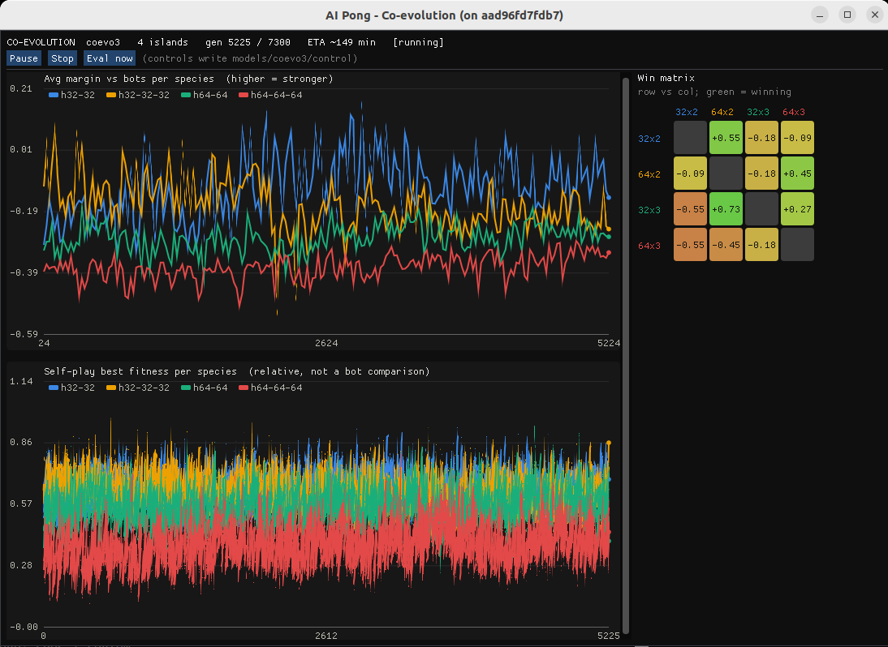

# AI Pong

An arena for **evolutionary self-play**: agents train against themselves and a hall-of-fame of
their own ancestors, rated on a Bradley–Terry Elo ladder anchored by scripted bots. Both
training tracks (GA self-play + PPO) and the Elo league are built; the strongest trained policy
— a memoryless GA champion — **beats the perfect-prediction Interceptor bot 95% of the time
(Elo 2014 vs 1843)**, tabled in **[docs/leaderboard.md](docs/leaderboard.md)**. (Rebuilt from an
earlier single-player prototype; the rationale behind every design call is in `DECISIONS.md`.)

## Design highlights

- **Both paddles are inputs** (`Input{left, right}`) with identical actuation — the built-in
  "computer" moved out of the core into a swappable **agent** framework.
- **Ball speed ceiling raised 1.6 → 100 cu/s** (court crossed in ~10 ms — unreturnable long
  before that, so every match ends by skill) with **substepped collision** so fast balls
  bounce instead of tunneling.
- **Rally cap 1000 hits** → game over, **no winner** (recorded as a loss for both sides).
- **Seeded serves**: serve angle jitters deterministically per (seed, point); seed 0 = legacy.
- **State-vector observation** `observation(snapshot, side)` — 6 doubles, mirrored so every
  agent "plays left"; this is the training interface (`docs/formats.md`).
- imgui frontend only (immediate mode suits an experiment control panel); qt/web/webview dropped.

## Quick start (everything runs inside docker)

    ./pong build                              # build image + compile (first run takes minutes)
    ./pong test                               # unit tests (headless)
    ./pong                                    # play (Enter at the boot menu; imgui-gpu if the window is black)
    AIPONG_MODEL=models/evo3_5/gen_2974.txt ./pong    # play against the champion

**In the window:** pick a controller for *each* paddle — Human (keyboard), a scripted bot
(P-controller or Interceptor), or any trained Model (curated champions + each run's best, shown
with its ladder Elo). Human keys are W/S or arrows; Space starts a new game. A "Sim speed" combo
fast-forwards bot-vs-bot matches, **Pause** (P) halts the sim, and **Record match** logs every
tick to `datasets/*.jsonl` for training.

## Layout

    pong        the one entry point — every subcommand runs in docker (run ./pong for usage)
    src/        all source, one module per directory:
                  core/     deterministic sim (pure; no agents, no IO)       → pong_core
                  agents/   P-controller, Interceptor, MlpAgent              → pong_agents
                  record/   MatchRecorder (JSONL) + rally database index     → pong_record
                  match/    controller spec registry + MatchRunner step loop → pong_match
                  train/    GA trainer (C++), PPO trainer (ppo.py), batched forward
                  league/   Bradley–Terry Elo ladder                         → pong_league
                  renderers/imgui/  game arena + training & co-evolution dashboards
                  bindings/ pybind11 VecPong module (the PPO env)
                  tools/    CLI mains: evolve, coevolve, ladder, memuse, aiming, rallydb, …
                  tests/    doctest suites, one per module
    docs/       training.md · evaluation.md · formats.md · leaderboard.md · media/
    models/     weights, local-only: <run>/ checkpoints, plus curated founders/ pools/
                probes/ leaderboard/ sets
    results/    eval outputs, local-only: ladder/<name>/ (ratings + matches JSONL)
    datasets/   recorded matches + rally index, local-only
    docker/     build image + GL shim

Dependency chain inside `src/`: `core → {agents, record} → match → {train, league}`;
`tools/` are thin CLI mains over those libs; `models/`, `datasets/`, `results/` are
gitignored — weights, recordings, and eval outputs stay local.

## Train, evaluate, inspect

    ./pong train                             # list the named training recipes
    ./pong train evomem                      # run one (overrides append: --seed 2 ...)
    ./pong ladder --dir models/<run>         # Elo over checkpoints → results/ladder/
    ./pong memuse <model.txt>                # is a memory model USING its history?
    ./pong aiming <model.txt>                # how does it beat the perfect defender?
    ./pong rallies build && ./pong rallies list --sort hits --top 20

Both trainers auto-launch the live dashboard (`./pong trainview`) — plots, ETA, and
Pause/Resume/Stop controls that park the run and release your cores. **Island co-evolution**
(`./pong coevolve`) races several architectures as separate GA demes, with its own dashboard
`./pong coview` — per-species margin-vs-bots + the live cross-island win matrix, same
Pause/Stop/Eval controls. Full recipes — memory
windows, opponent-diversity fitness, curricula, warm starts, resume — in
**[docs/training.md](docs/training.md)**; the four evaluation tools in
**[docs/evaluation.md](docs/evaluation.md)**; every data format (model weights, recorded
matches, rally index) in **[docs/formats.md](docs/formats.md)**.

*The co-evolution dashboard (`./pong coview`) — four architectures raced as GA demes: per-species
margin vs the scripted bots and self-play fitness (left), the live cross-island win matrix (right),
with pause/stop/eval controls.*

## The Model slot

`MlpAgent` loads a tiny MLP policy (format: `docs/formats.md`) and plays it via the
observation vector. No trained model yet? Generate a random-weights one to exercise the
pipeline end-to-end:

    ./pong genmodel 42                      # writes models/random.txt
    AIPONG_MODEL=models/random.txt ./pong   # it plays terribly — that's the point

## Documentation

- [docs/training.md](docs/training.md) — GA + PPO recipes, resume, the evomem/ppo3 configs
- [docs/evaluation.md](docs/evaluation.md) — ladder, memuse, aiming; where outputs land
- [docs/formats.md](docs/formats.md) — the training interfaces: `aipong-mlp`, `aipong_match`, rally index
- [docs/leaderboard.md](docs/leaderboard.md) — current standings + the memory experiment's verdict
- `DECISIONS.md` — every design call, chronological and indexed
- `CLAUDE.md` — repo conventions (core/agent purity, units, doctest discipline)
